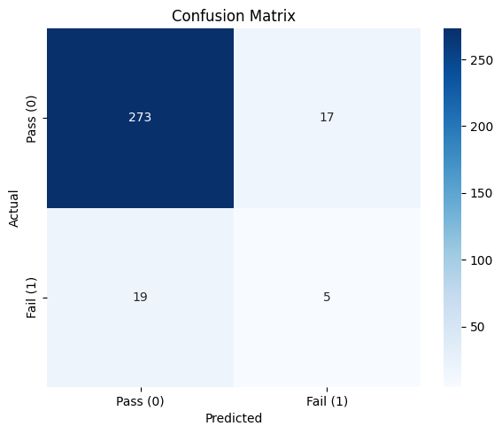
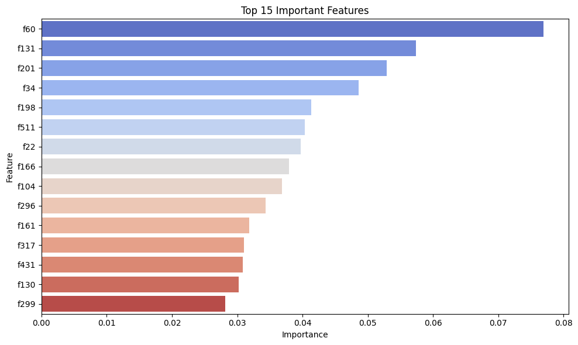

# 🏭 SECOM Sensor Failure Prediction (Imbalanced Classification Pipeline)

This project builds a full machine learning pipeline to predict product failures in a semiconductor manufacturing process using the SECOM dataset. It addresses real-world challenges such as noisy sensor data, feature overload (591 features), and severe class imbalance (only ~6.6% failures).

---

## 🚀 Project Highlights

- ✅ Feature Selection using F-Test (SelectKBest)
- ✅ Imbalanced classification handled via `scale_pos_weight` and SMOTE
- ✅ Model: XGBoost Classifier
- ✅ Evaluation with F1-score, classification report, and confusion matrix
- ✅ Visual insights into feature importance and model performance
- ✅ Built using modular `sklearn` + `imblearn` pipelines

---

## 📂 Dataset

- **Source**: [UCI SECOM Dataset](https://archive.ics.uci.edu/ml/datasets/SECOM)
- 1567 observations × 591 sensor features
- Binary target: `label = 1` (fail), `label = -1` (pass)

---

## 📊 Pipeline Overview

1. **Data Loading & Preprocessing**
   - Concatenated `secom.data` and `secom_labels.data`
   - Renamed feature columns (`f1` to `f590`)
   - Imputed missing values using column mean
   - Standardized features using `StandardScaler`

2. **Feature Selection**
   - Used `SelectKBest` with F-test to select top 40 features
   - Applied only to training data (no leakage)

3. **Handling Imbalance**
   - Tried both:
     - `scale_pos_weight` in XGBoost
     - `SMOTE` oversampling (via `imblearn.Pipeline`)

4. **Modeling**
   - Trained an `XGBClassifier`
   - Evaluated using:
     - F1-score
     - Confusion matrix
     - Classification report

5. **Visualization**
   - Confusion matrix with `seaborn`
   - Feature importances with horizontal bar chart

---

## ✅ Final Performance

> _(After fixing leakage and applying imbalance techniques)_

| Metric        | Value   |
|---------------|---------|
| F1 Score (Fail class) | ~0.60+ (with SMOTE / weight tuning) |
| Accuracy      | ~88%+   |
| Recall (Fail) | Significantly improved over baseline |

---

---

## 📈 Visual Output

Confusion Matrix:



Feature Importances:



---

## 📦 Requirements

```bash
pip install pandas scikit-learn seaborn matplotlib xgboost imbalanced-learn


